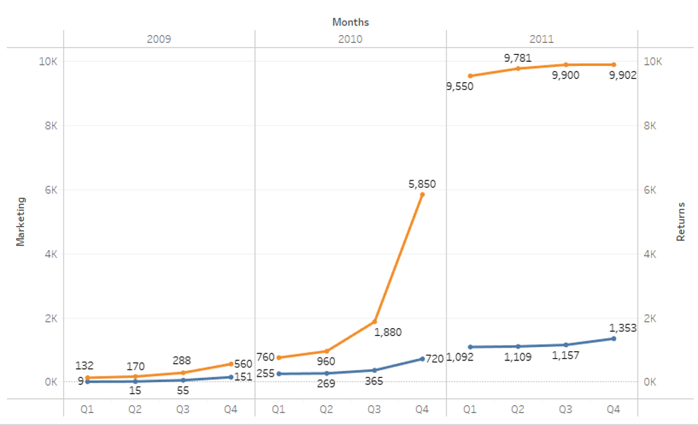

# Marketing-Campaigning-Optimization

## Summary
This project helps us to create a Marketing cost portfolio about various srategies Max Trends can implement to re-engineer their  stagnated online sale. Over here we levarage the power of MS Excel and its addins to formulate a portfolio, we use following methods:

* Optimal Decision Tree									
* Risk Profile											
* One Way Sensitivity Analysis								
* Strategy Region									         
* Tornado Graph									          
* Two Way Sensitivity Analysis	

## Who are Max Trends?
Max Trends is an online Fashion based e-commerce company located in Bay Area, Castro Valley. It was established in May 2009 with a goal of providing unique fashionable jackets/hoodies with a sales scope throughout San Francisco, Alameda, San Mateo county. 

They started as online based retail website, with a team of 10 members. 
As seasons progressed, they started to experience popularity and growth and they started to sell throughout the state of California. In 2010 they opened their first physical retail store in San Mateo and Hayward in consecutive quarters.

In 2011 their online sales started to stagnate. And a decision was made to invest a larger chunk in marketing and re-engineer marketing strategies. In the next spring season (January - March 2012) they were about to start a new spring sales season and decided to hire a market analyst team. The team did extensive market research on previous trends. They were able to devise various campaigning plans.

## Why was a decision made to re-engineer marketing strategy?

A research about Returns vs Marketing in quarters was conducted.
It was found that there was an upward trend in all quarters
* Year 2009 – There were a return of $151k equivalently to the marketing budget. Hence, the 2009 had a breakeven situation as it was the starting year.
*	Year 2010 – There was a rise in marketing budget also the returns increased up to an 69%. Finally, in quarter 3 the company started to have exponential returns ($5850k).
*	Year 2011 – The Returns were very high when compared to marketing budget. But there was an interesting observation, though the returns were high, they were stagnant i.e. There was no noticeable increase throughout quarters.

Hence, the board decided to re-engineer marketing campaigns for the next fashion season release. An exhaustive marketing analysis was performed by the marketing team.

## Possible Marketing Strategies
### Marketing Analysis
The Team decided to segment the season on three campaigns
*	Direct customer engagement
*	Indirect customer engagement
*	Search engine optimization

### Direct customer engagement 
Direct customer engagement is a strategy to communicate to potential customers physically (SMS/Email/Physical Coupons)
*	SMS – The main cost associated with SMS is to create a target list (TG) of potential customers that would click the link and come to the website. The team estimates an investment of $300k for TG list and SMS sending cost. SMS is estimated with an effectiveness of 60% and returns of 350k. If it is proved to be ineffective the company would have to send a reminder SMS to the potential customers who did not open the SMS link having an additional cost of $120k with an effectiveness of 30% and returns of 350k and if proven ineffective it will have returns of 540k.
*	Email – The associated cost with emails are comparatively low $250k but the effectiveness is equivalently low because the team thinks customers do not open their emails frequently and also some of the mails are lost in spam mails. Hence the team calculated an effectiveness of 21% with a returns of 150k and if proven ineffective it will have returns of 450k.
*	Physical Coupons – These are coupons given to customers at till (retail store). For ex. 30$ off on winter shopping. The team estimates an effectiveness of 72% with an investment of $570k and returns of 330k. If the customers to whom the coupons were issued do not redeem it, a reminder SMS will be sent to similar to the effectiveness of reminder SMS.
Indirect customer engagement is holistic approach to market a product where the Target list in undefined. It is purely based on chance that a customer will buy after seeing the add. It is further, segmented into Social Media and newspaper promotion.
*	Social Media – As per market survey Social media has proven to be an innovative as well as low cost approach throughout retail industry as whole world is connected through social media and it proves to be an innovative approach. The investment is fairly low of 350k with an effective rate of 70% with returns of $500k. Just in case it proves to be ineffective the team is adamant on doing a SEO approach which is explained later in the report.
*	Newspaper promotion – It is a classic approach to provide pamplets in news paper with an investment of $250k with an effective rate of 32% and returns of 380k and ineffective rate of 68% and returns of $20k.

### SEO

Search engine optimization is the process of increasing the quality and quantity of website traffic by increasing the visibility of a website or a web page to users of a web search engine.
SEO can be done by training existing team or can be done by outsourcing it to a third party company.
*	Indigenous team – It includes the team training cost as well as using SEO software of around $200k with an effective rate of 55% and returns of 1000k and ineffective rate of 15% on and returns of $150k.
*	Third-party SEO – The team decided to team up with VMW analytics, a SEO outsourcing company. The company charges $280k with an effective rate of 65% and returns of 1000k and ineffective rate of 35% on and returns of $300k.

### Optimal Decision Tree

After analysing the above optimal decision tree, the best decision for Max Enterprises is to invest in Indirect Communication. If the company decides to choose Social Media as the indirect communication marketing strategy and if it is effective, then the company will earn $500,000. If it is ineffective, the company decides to choose SEO strategy which is led by the Indigenous SEO team in the company. If this marketing strategy is effective, the company will earn $650,000 and if it is ineffective the company would lose $200,000.
However, the best optimal decision path for Max enterprises would be to choose the indigenous SEO team which benefit the company with a payoff of $430,250.

### Risk Profile

This Risk Profile Decision Analysis report gives the Probability chart (which we have selected). Here we get to know the chances of different outcomes, i.e. chance to win or loose. From the chart we can see and analyze following things:
X - Axis = Payoffs
Y- Axis = Probabilities of the Payoffs
The first observation (bar) tells us that the Payoff value is -$200,000 (with 13.5% chance) when the plan provided by the indigenous team is ineffective. 
The Second observation (bar) tells us that the Payoff value earned is $500,000 (with 70% chance), if the company chooses social media as the platform for marketing and it is effective.
The Third observation (bar) tells us that the Payoff value earned is $650,000 (with 16.5% chance), if the plan provided by the indigenous team is effective.

### One Way Sensitivity Analysis

The above graph represents the one-way sensitivity analysis for Coupon cost vs the EMV.
As seen from the chart, if the coupon cost is between $200,000 - $330,000, the value of coupon cost is highly sensitive to variation in the value of EMV. However, we can observe that after $330,000 if we further increase the value for the coupon cost the EMV value remains stagnant ($430,000) and is insensitive to variation in coupon cost.

The above graph represents the one-way sensitivity analysis for Social Media effective probability vs the EMV.
As seen from the chart, if the effective probability (social media) is between 0.1 – 0.62, the EMV value is insensitive to the variation in change of probability. However, we can observe that after value of probability is increased above 0.62 the EMV value is sensitive to this change. Thus it means that if we increase the probability for social media then the return (pay off) will be higher.

The above graph represents the one-way sensitivity analysis for SMS cost vs the EMV.
We can infer from the above chart that any investment in SMS cost is insensitive to the variation in EMV and will get the same EMV of approximately $430,280.

### Strategy Region

From the Strategy Region chart of Sensitivity Analysis against variation in coupon cost, we can see that the optimal decision is to choose Direct Communication as the best decision if the coupon cost is between $200,000 - $300,000. After, $300,000 indirect communication is the best optimal decision. 
Moreover, it can be observed that indirect communication and SEO are insensitive to variation. 
The decision of SEO will never be the best decision for any value of EMV.

From the Strategy Region chart of Sensitivity Analysis against the variation in social media effective probability, we can see that the optimal decision is to choose SEO strategy as the best decision if the social media effective probability is between 0.1 – 0.65. After, 0.65 indirect communication is the best optimal decision. 
Moreover, it can be observed that direct communication and SEO are insensitive to variation.The decision of direct communication will never be the best decision for any value of EMV.

From the Strategy Region chart of Sensitivity Analysis against the variation in Newspaper effective probability, we can see that the optimal decision is to choose Indirect communication strategy as the best decision for any changes in the value of newspaper effective probability.
Moreover, it can be observed that direct communication and SEO are insensitive to variation. 
The decision of direct communication will never be the best decision for any value of EMV.

### Tornado Graph

 

From the Tornado Graph of Decision Tree of ‘Max Enterprises’ we can analyze and tell that most impact driven parameter considered for sensitivity analysis is the Coupon Cost which has large and highest variation in EMV.
The second most impact driven parameter is Social Media Effective Probability.
Finally the parameters, “SMS Cost”, “Email Cost”, “Newspaper effective probability” have little or almost negligible impact on the value of EMV.

### Two Way Sensitivity Analysis

Following is the output for two-way sensitivity analysis. It can be observed that X axis (200 – 600 for indigenous cost) and Y axis (325 -600 for third party SEO company), in this region the optimal decision will be the choose indirect communication as the best marketing strategy. For the remaining coordinates, the best decision would be to select the marketing strategy provided by the third party SEO company.
Overall, the best optimal decision is to choose indirect communication as the best marketing strategy and to invest money in indigenous SEO team.

